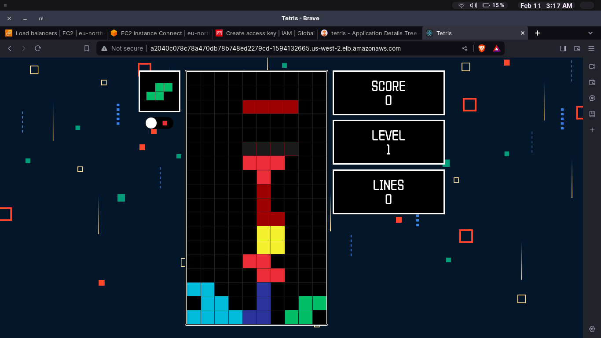

# DevSecOps Project-Deploying a Tetris game on EKS cluster

<h1 align="center">
  
</h1>

DevSecOps Project-Deploying a Tetris game on EKS cluster 

## Phase 1: Initial Setup and Deployment

In this phase, an EC2 instance was provisioned on AWS with Ubuntu 22.04, and the Tetris game was deployed. The process included cloning the core repository, installing Docker, and running the application within a container.

## Phase 2: Security

Security measures were implemented by installing SonarQube, Trivy, and OWASP Dependency Check on the EC2 instance for continuous code quality and security checks. The integration of these tools into the CI/CD pipeline ensured robust security practices.

<h1 align="center">
  
</h1>

<h1 align="center">
  
</h1>

## Phase 3: CI/CD Setup with Jenkins

Jenkins was installed on the EC2 instance to automate the deployment process. The pipeline was configured to build and deploy the Tetris game. Plugins for SonarQube, Node.js, and email notifications were added. The pipeline also incorporated OWASP Dependency Check and Trivy scans for enhanced security checks. The final Docker image was then deployed to Docker Hub.

<h1 align="center">
  
</h1>

## Phase 4: Monitoring

Monitoring capabilities were established using Prometheus and Grafana on a separate server for monitoring. Prometheus was set up to collect comprehensive data, and Grafana provided visualizations for monitoring system performance. Node Exporter was utilized for monitoring the EKS cluster, ensuring dynamic issue identification and resolution.

<h1 align="center">
  
</h1>

## Phase 5: Notification

This phase involved the implementation of notification services using Email for pipeline status in Jenkins.

<h1 align="center">
  
</h1>

## Phase 6: EKS Integration using Terraform

The final phase focused on the integration of AWS Elastic Kubernetes Service (EKS) for efficient Kubernetes cluster management. Node Exporter was deployed to facilitate the monitoring of the Kubernetes cluster. The Tetris game was successfully deployed on the Kubernetes cluster using ArgoCD, ensuring scalable and containerized application deployment.

<h1 align="center">
  
</h1>
     

